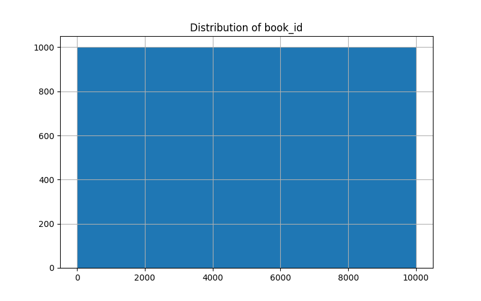
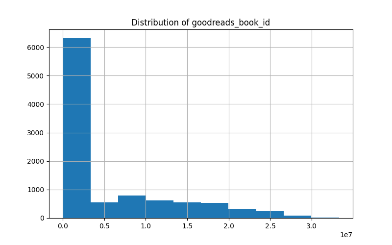

# Analysis Report

## Generated Story
### Dataset Story
Here is the summary of the dataset:

The dataset provides a comprehensive overview of 10,000 books, primarily from Goodreads, encompassing various attributes that outline their popularity and reception. Here’s a storytelling summary based on the key points:

### Key Highlights:

1. **Diversity of Books**: The dataset features a rich variety of books with 9,300 unique ISBNs, showcasing works from a vast array of authors, with Stephen King being notably prolific, as he appears frequently among the top authors.

2. **Timeframe of Publication**: The books span from as early as 1750 to 2017, with a mean original publication year around 1982. This illustrates a broad historical perspective, allowing for an exploration of literary trends over the centuries.

3. **Popularity and Ratings**: 
   - The average rating across the dataset stands at approximately 4.00, indicating a generally favorable reception among readers.
   - With an impressive ratings count averaging around 54,000 per book, certain titles have garnered immense attention, as evidenced by record ratings—one book received as many as 1.48 million ratings.

4. **Engagement Levels**: The dataset indicates a considerable amount of interaction, with an average of nearly 3,000 text reviews per book, suggesting that many readers are not only rating but actively engaging with the material.

5. **Rating Distribution**: The ratings are heavily skewed towards higher scores, with a significant frequency of books receiving five-star ratings, reflecting strong reader approval and engagement.

6. **Language Representation**: Predominantly in English, the dataset captures the majority of literary contributions within the English-speaking community, coherently reflecting current popular trends in literature.

### Visual Elements:
- The dataset includes placeholder image URLs that suggest the presence of cover art, which could enhance the storytelling experience by visually representing each book, alongside providing a more immersive feel to the narrative.

### Conclusion:
This dataset encapsulates a vibrant and engaging landscape of literature, showcasing not only the popularity and diverse range of books but also highlighting readers' meaningful engagement with these works. As such, it serves as a rich resource for exploring literary interests and understanding trends in reader preferences across different periods.

### Visual Insights
The following visualizations were generated based on the dataset:
- book_id_distribution.png
- goodreads_book_id_distribution.png
- correlation_heatmap.png

## Visualizations

