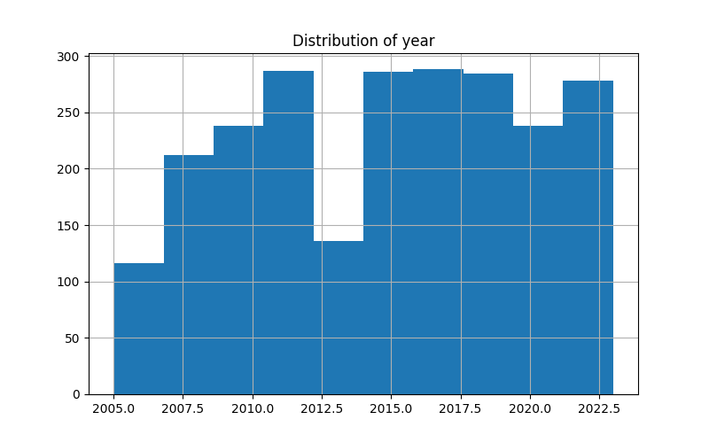
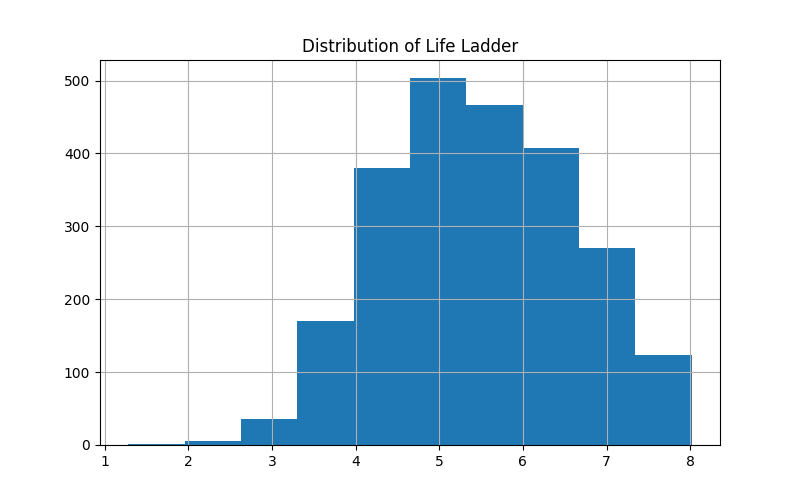

# Analysis Report

## Generated Story
### Dataset Story
Here is the summary of the dataset:

This dataset provides a comprehensive overview of well-being across 165 countries, encompassing various indicators for the years 2005 to 2023. It includes 2,363 entries measuring the following key aspects:

1. **Life Ladder**: The average score of life satisfaction, with a mean value of approximately 5.48, ranging from a low of 1.28 to a high of 8.02. This suggests a general trend towards higher life satisfaction in recent years, with noticeable improvements from 4.65 in the 25th percentile to 6.32 in the 75th.

2. **Log GDP per capita**: This variable assesses economic performance, yielding a mean of 9.40, indicating significant economic diversity among nations. The range spans from 5.53 to 11.68, showcasing the disparity between the wealthiest and poorer countries.

3. **Social Support**: Represented by a mean value of 0.81, this metric demonstrates the availability of social backing in times of need. It exhibits a general upward trend in support levels, with notable increases from a lower quartile of 0.74 to a higher quartile of 0.90.

4. **Healthy Life Expectancy at Birth**: With an average of 63.40 years, life expectancy signifies general health standards within countries, fluctuating from a minimum of around 67 years to a maximum of 74 years.

5. **Freedom to Make Life Choices**: This indicator averages at 63.40, suggesting a moderate level of personal freedom in life choices across the dataset, further divided from 59.20 to 68.55 across quartiles.

6. **Generosity**: A mean score of 0.75 indicates the willingness to help others, with values ranging from 0.23 to 0.98, suggesting varied philanthropic behavior in different sociocultural contexts.

7. **Perceptions of Corruption**: This metric shows minimal concerns regarding corruption (mean near zero), reflecting mixed views towards governance with a broad range indicating significant variations among countries.

8. **Positive and Negative Affects**: The dataset reveals a generally positive outlook on life with a positive affect mean of 0.74 and a negative affect mean of 0.27, suggesting overall emotional well-being is prevalent.

Overall, this data unveils a narrative of increasing life satisfaction and social support, alongside economic growth, while highlighting significant disparities in wealth, health, and governance perceptions worldwide. The insights derived from these indicators can frame discussions on global happiness, the influence of economic variables on life satisfaction, and the social determinants of health across different cultures.

### Visual Insights
The following visualizations were generated based on the dataset:
- year_distribution.png
- Life Ladder_distribution.png
- correlation_heatmap.png

## Visualizations

