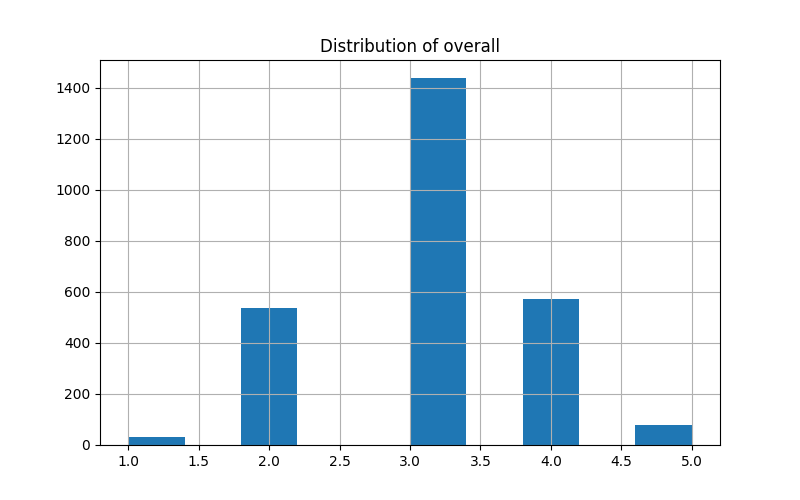
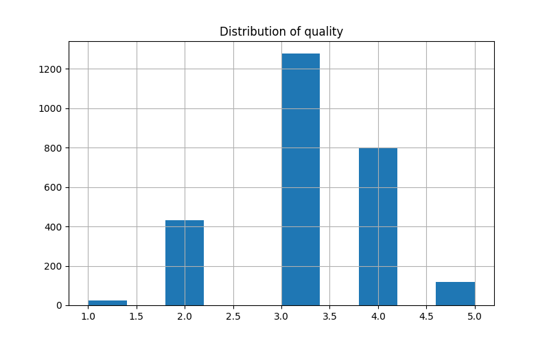
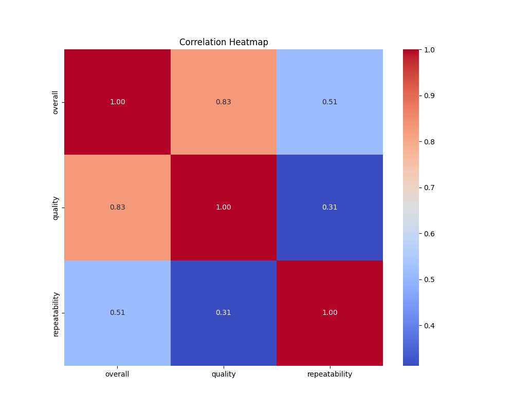

# Analysis Report

## Generated Story
### Dataset Story
Here is the summary of the dataset:

This dataset encompasses a collection of 2,553 entries, summarizing a diverse array of media identified by language, type, title, and author. The key highlights are:

- **Languages**: The dataset features media primarily in English, spanning a total of 11 different languages.
- **Types**: There are eight distinct types of media, with the majority classified as movies.
- **Titles**: A total of 2,312 unique titles are present, with "Kanda Naal Mudhal" being the most frequently mentioned, appearing 9 times.
- **Authors**: The works are attributed to 1,528 unique authors, demonstrating a wide pool of creative contributors.

**Ratings**:
- The overall ratings range from a minimum of 1 to a maximum of 5, with a calculated average (mean) score of approximately 3.05. 
- Quality ratings average slightly higher at 3.21, suggesting a general perception of good quality across the dataset.
- Repeatability, which appears to measure how often the content can be found or revisited, averages around 1.49, indicating some media are revisited more than once, but it is not a predominant feature.

**Statistical Insights**:
- There is substantial variability in ratings, as demonstrated by a standard deviation of around 0.76 for overall ratings and 0.80 for quality ratings. 
- The interquartile range reflects that while many entries are rated 3, there are some standout pieces rated higher, particularly with quality assessments reaching up to 5.

Overall, this dataset paints a picture of a rich and varied media landscape, where patterns of quality and preference can be drawn from the engagement with titles and their creators.

### Visual Insights
The following visualizations were generated based on the dataset:
- overall_distribution.png
- quality_distribution.png
- correlation_heatmap.png

## Visualizations

